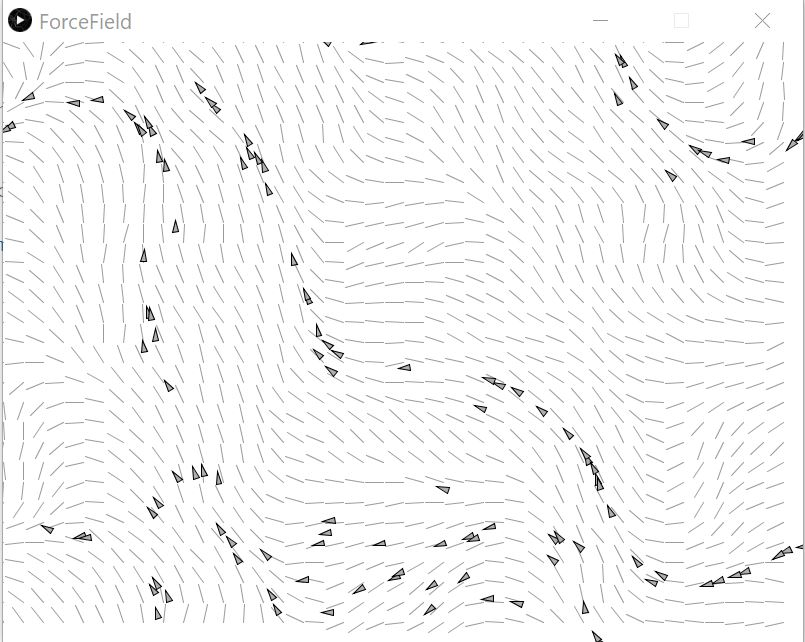
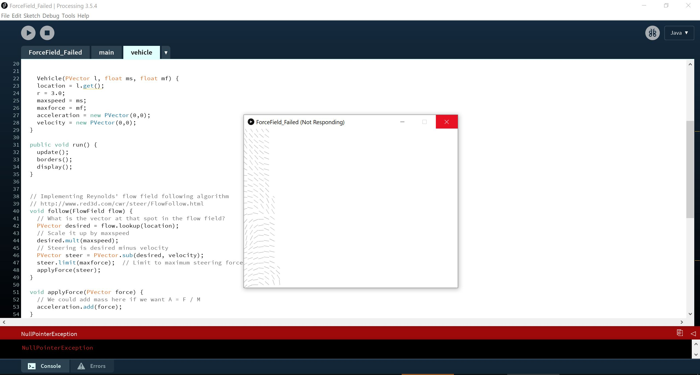

# RobotaPsyche
## February 8th - Assignment 1
I struggled a lot with the vector funtions (velocity.add and all those)and had to get back to Daniel's Youtube videos multiple times and I managed to get a better understanding of them even though i still find them confusing. I wanted to experiemnt with uploading an image and made the rocket more fun with a png image that I used in my code. I wanted to make the rocket roate when it changes direction and ended up using float theta = velocity.heading2D() in my code even though I didn't quite undersnad how it differs (if at all) from rotate(velocity.heading()) which is what Professor Michael showed us in class. Overall, this assignemt made me understand vectors a but betetr and I am happy that I could make my code work!

## February 10th - Assignment 2 
List of forces:
1) leaf blown by the wind 
2) leaf floating on the surface of a lake
3) sail boat on a lake
4) boat on the surface of the sea during a storm 
5) bungie jumper
6) skydiver 

## February 15th - Assignnment 3
I found force fields confusing so the goal of doing this assignemt for me was to undertstand them better. I watched Daniel's Shiffman's videos and got inspired by one of the force fields that he made so I tried to recreate it on my own. Since I used the video to understand it, the code is very similar to what Daniel used, but I was proud of being able to make it work on my own. 

I thought that the pattern of the movement looked a lot like a school of fish in an ocean so I tried to use an image of a fish to replace the trianges. The code didn't work however (I would post it here anyway for Michael to have a look) and it kept giving me an error that I didnt find the cause of because all the variables seemed defined to me. It was taking to much time so I unfortunately had to give up even though I suspect that the error is something silly :( I would like to talk to Michael about it in class and hopefully get it to work!

 
